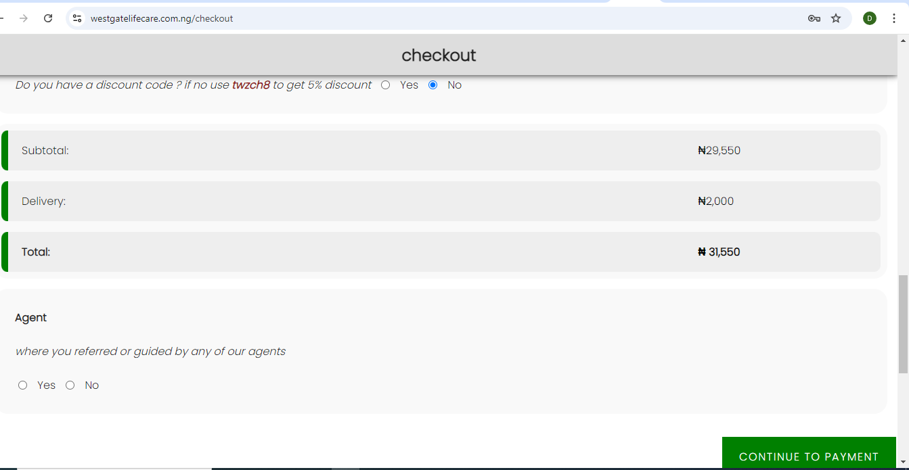

<h1>Westgate Lifecare Supermarket</h1>

.png)

[westgate lifecare](https://westgatelifecare.com.ng) is more than just an online store—it’s a comprehensive platform that brings together a diverse selection of high-quality products across categories like:

* Supermarket: Stock up on everyday essentials and household items.
* Grocery: Fresh produce, pantry staples, and more.
* Pharmacy: Trusted health products and medications for your well-being.
* Cosmetics: Discover the best beauty and skincare products.
* Restaurant: Order meals from our variety of cuisines, including local favorites.
* Nature Fresh: Organic and farm-fresh products for healthy living.
* Bakery: Freshly baked goods delivered to your door.
* TechHub: The latest gadgets and electronics to keep you connected.
* Suya Spot & Grills: Enjoy mouth-watering, expertly grilled meals.
* Fashion: Stay stylish with our wide range of clothing and accessories.
* Lounge: Unwind with premium lounge services and experiences.

[westgate lifecare](https://westgatelifecare.com.ng) is designed with your convenience in mind. With a secure checkout system, multiple payment options, and fast delivery, we ensure that your shopping experience is smooth and hassle-free. Whether you’re stocking up on groceries, shopping for the latest tech, or grabbing a quick meal, Westgate Lifecare has you covered.

## Table of Contents 
1. [Introduction](#introduction)
2. [Features](#features)
3. [Installation](#installation)
4. [Usage](#usage)
5. [Project Timeline: From Concept to Reality](#project-timeline-from-concept-to-reality)
6. [Technical Challenges and Solutions](#technical-challenges-and-solutions)
    - [1. Payment Gateway Integration](#payment-gateway-integration)
    - [2. Managing Cart State](#managing-cart-state)
    - [3. Deployment on AWS](#deployment-on-aws)
7. [Next Iteration: What's on the Horizon](#next-iteration-whats-on-the-horizon)
8. [Screenshots](#screenshots)
9. [The Human Behind the Code](#the-human-behind-the-code)
10. [Try It Out](#try-it-out)
11. [Tech Stack](#tech-stack)
12. [Acknowledgments](#acknowledgments)

## Introduction

My work on [Westgate Lifecare](https://westgatelifecare.com.ng) eCommerce website was born out of a desire to solve the challenges faced by many enterprises in the online retail space. Initially, I was building an eCommerce platform for a personal solar energy project. During that time, a former colleague reached out to discuss the limitations of his company's website—issues I was already familiar with from previous industry experience. His main concerns involved the payment gateway, cart system, and inventory management. He needed a website with all the essential features of a leading eCommerce platform, providing customers with a seamless experience.

I explained that I was currently developing a website addressing similar problems. After quickly setting up an AWS cloud server and providing a demo, he was impressed by the functionality. We discussed how to tailor these features for Westgate Lifecare’s unique needs, further solidifying my decision to focus on building a robust, scalable solution for businesses.

## Features
- **Easy to Use**: Intuitive design for seamless user experience.
- **Fast**: Optimized performance to ensure quick browsing and checkout.
- **Secure**: Integration with secure payment gateways and data protection mechanisms.

## Installation
1. Clone the repository
    git clone https://github.com/ogbuman/Project-west.git
2. start server
3. load index page
## Usage

Once installed, the platform offers a variety of eCommerce functionalities, including:

- Product browsing
- Cart management
- Secure checkout
- Order tracking

## Project Timeline: From Concept to Reality

When I first started developing Westgate Lifecare, I underestimated the complexity of building a fully functional eCommerce platform from scratch. Here's a rough timeline of how things progressed:

- **Week 1**: Research and planning, focusing on core features like product listings, cart functionality, and user authentication.
- **Week 2**: Built the product catalog and inventory management system, dealing with dynamic data handling challenges.
- **Week 3**: Integrated payment processing and secured the checkout flow, which posed significant challenges.
- **Week 4 and beyond**: Improved UI, optimized backend for performance, and deployed the project.

Each phase provided valuable learning experiences, from balancing aesthetics and functionality to managing asynchronous checkout requests.

## Technical Challenges and Solutions

### 1. Payment Gateway Integration

Integrating Stripe as the payment gateway was the most challenging technical hurdle. Although Stripe's documentation was comprehensive, ensuring secure user data handling and meeting payment best practices was tough. Managing multiple payment methods and handling transaction failures pushed me out of my comfort zone.

### 2. Managing Cart State

Initially, managing the shopping cart state seemed simple. But I soon realized the importance of persistent data across user sessions. I delved into managing states between client-side and server-side, learning how session management works to enhance user experience.

### 3. Deployment on AWS

Using AWS services like Ec2 , Route 53 for DNS, and CloudFront for asset delivery came with a steep learning curve. I set up a CI/CD pipeline to make deployments smoother and troubleshot various issues, including securing SES for transactional emails and correctly linking the domain.

## Next Iteration: What's on the Horizon

I'm proud of the progress so far, but I plan to continue improving Westgate Lifecare by focusing on:

- **Enhanced Search Functionality**: Implementing AI-driven product recommendations and an intuitive search experience.
- **Mobile-first Design**: Optimizing for seamless browsing and purchasing on mobile devices.
- **User Analytics**: Gathering insights from user behavior to suggest related products and health tips.
- **Delivery Tracking**: Real-time tracking for orders from warehouse to doorstep.

## Screenshots

Here are some screenshots of the platform as it stands today:

- **Homepage**: A user-friendly homepage where users can browse a wide range of products.
.png)

- **Product Detail Page**: Detailed view of a specific product, allowing users to add items to their cart.

- **Checkout**: A smooth and secure checkout process powered by paystack.

## The Human Behind the Code

Building Westgate Lifecare has been an incredible journey of growth and perseverance. I've faced challenges like debugging asynchronous calls and refactoring code, but what kept me going was the knowledge that I’m solving real-world problems. This project isn’t just about technical skills; it's about dedication, empathy, and creating something valuable.

I hope Westgate Lifecare represents not just technical proficiency but also passion and care in every line of code.

## Try It Out

Feel free to explore the project yourself:

🔗 [Westgate Lifecare](https://westgatelifecare.com.ng)

Let me know what you think, and if you'd like to collaborate on future iterations or similar projects!

## Tech Stack

- **Frontend**: Html, Css, javascript
- **Backend**: Node.js, Express, MongoDB
- **Payment Gateway**: Paystack
- **Cloud Services**: AWS (SES, Route 53, CloudFront)

## Acknowledgments

- **Inspiration**: To the countless developers whose open-source projects helped me reach this point.
- **Community**: Thanks to everyone who provided feedback along the way.
- **westgate lifecare team**: Thanks to everyone who in westgate who help me with the project.

This platform is a work in progress, and I am constantly working to improve it with new features and better user experiences.
